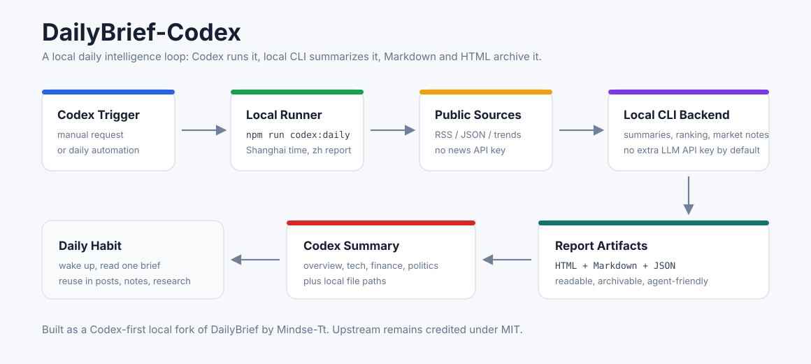

# DailyBrief-Codex

许惟的本地每日情报工作流：让 Codex 每天跑一次资讯抓取、模型摘要、市场信号和报告归档，然后把结果用中文总结给你。

这不是一个单纯的 DailyBrief fork。这个版本把原项目改造成了更适合个人 AI 工作流的形态：

- 默认本地运行，不要求配置 LLM API Key
- 用 `npm run codex:daily` 作为 Codex / 自动任务入口
- 固定输出 HTML、Markdown、JSON，方便阅读、归档和二次加工
- 内置 `dailybrief-codex` Skill，可以直接让 Codex 调用
- 每天可由 Codex 自动任务触发，并在完成后给中文日报摘要

> Upstream: 本项目基于 [leiting-eric/DailyBrief](https://github.com/leiting-eric/DailyBrief) 改造，保留 MIT License 和原项目核心能力。这里的重点是 Codex-first 的本地自动化包装。

## Workflow



```text
Codex request / automation
  -> npm run codex:daily
  -> fetch public RSS / JSON sources
  -> local CLI backend summarizes and ranks
  -> write HTML / Markdown / JSON
  -> Codex reads the report and returns a Chinese digest
```

## What Makes It Different

| 原 DailyBrief | DailyBrief-Codex |
|---|---|
| 面向通用部署，README 重点是 GitHub Actions / API backend / Pages | 面向个人本地工作流，README 重点是 Codex 调用和每日自动汇报 |
| GitHub Actions 模式通常需要 LLM API Key | 默认走本机已登录 CLI backend，不需要额外 LLM API Key |
| 主要交付 HTML 页面 | 同时固定交付 HTML、Markdown、JSON，方便 Codex 读取和二次总结 |
| Claude Code skill 是上游本地安装的一部分 | 额外内置 Codex Skill：`skills/dailybrief-codex/` |
| 需要用户记运行命令和路径 | Skill 和 wrapper 固化路径发现、运行、验收、失败排查 |

## Quick Start

```bash
git clone https://github.com/Mindse-Tt/DailyBrief-Codex.git
cd DailyBrief-Codex
npm install
cp codex.env.example .env.local
npm run codex:daily
```

默认配置：

```bash
LLM_BACKEND=claude-cli
CLAUDE_MODEL=sonnet
REPORT_LOCALE=zh
REPORT_TZ=Asia/Shanghai
OUTPUT_MARKDOWN=true
```

生成结果：

```text
daily_reports/YYYY-MM-DD/YYYY-MM-DD.html
daily_reports/YYYY-MM-DD/YYYY-MM-DD.md
daily_reports/YYYY-MM-DD/YYYY-MM-DD.json
daily_reports/YYYY-MM-DD/YYYY-MM-DD-articles.json
```

同时会复制一份到桌面归档入口：

```text
~/Desktop/DailyBrief每日存档/YYYY-MM-DD.html
~/Desktop/DailyBrief每日存档/YYYY-MM-DD.md
~/Desktop/DailyBrief每日存档/YYYY-MM-DD.json
```

这个入口默认指向 `~/DailyBrief每日存档`，结构和 `AIHOT每日存档` 一样，方便每天直接从桌面打开。

## Use As A Codex Skill

本仓库已内置 Skill：

```text
skills/dailybrief-codex/
```

安装到本机 Codex：

```bash
mkdir -p ~/.codex/skills
cp -R skills/dailybrief-codex ~/.codex/skills/
```

如果 DailyBrief-Codex 不在默认位置，设置项目路径：

```bash
export DAILYBRIEF_CODEX_ROOT=/absolute/path/to/DailyBrief-Codex
```

然后对 Codex 说：

```text
用 dailybrief-codex 跑今天日报并总结给我。
```

Skill 也单独发布在：

- [DailyBrief-Codex-Skill](https://github.com/Mindse-Tt/DailyBrief-Codex-Skill)
- [xuwei_tools / dailybrief-codex](https://github.com/Mindse-Tt/xuwei_tools/tree/main/dailybrief-codex)

## Daily Automation

推荐把它挂成每天早上的 Codex 自动任务：

```text
进入 DailyBrief-Codex 仓库，运行 npm run codex:daily。
成功后读取当天 Markdown / JSON，给我中文日报摘要，并附上 HTML 和 Markdown 路径。
失败时先看 logs/daily-YYYY-MM-DD.log，再给出原因和修复建议。
```

我的本机默认时间是每天 `08:30`，上海时区。

## GitHub Actions

这个仓库的 GitHub Actions 已改成手动触发，不再自动定时生成日报。

原因很简单：GitHub 云端 runner 不能读取你本机已经登录的 Claude / Codex CLI，所以一旦让 Actions 定时跑，它还是需要 `ANTHROPIC_API_KEY`、`OPENAI_API_KEY` 或类似的云端 LLM Key。DailyBrief-Codex 的默认路线是本地无 Key 运行：

```text
Codex automation -> npm run codex:daily -> local CLI backend
```

如果你以后想把日报发布成 GitHub Pages，可以手动运行 Actions，并按上游方式配置云端 LLM backend 和对应 API Key；日常使用不需要这样做。

## Report Shape

一轮日报通常会包含：

- 今日总览：技术、财经、时政的合并主线
- 技术动态：AI、开源、研究、产品发布
- 财经要点：美股、宏观、公司财报、油价等
- 时政观察：国际要闻和地缘风险
- 市场行情：21 个美股 / 加密 / 中港 / 商品外汇标的的技术指标和模型点评
- 本地归档：HTML 适合阅读，Markdown 适合复盘，JSON 适合二次处理

## Token And Runtime

一次完整日报在本机实测大约：

- 5 到 8 分钟
- 8 次左右 LLM 调用
- 约 3 万 LLM token 量级

实际消耗取决于当天源数量、摘要长度和所选 backend。Codex 额外总结会再消耗少量 token。

## Project Layout

```text
scripts/codex-daily.mjs          # Codex-friendly local runner
codex.env.example                # No-key local default config
CODEX.md                         # Codex automation and skill notes
skills/dailybrief-codex/         # Installable Codex Skill
lib/sources/                     # Source fetchers
lib/ai/                          # LLM backend, prompts, enrichment
lib/trading/                     # Market watchlist and indicators
lib/output/render.ts             # HTML / Markdown renderer
daily_reports/                   # Generated local reports, gitignored
logs/                            # Run logs and LLM call logs, gitignored
```

## Troubleshooting

| Problem | First Check |
|---|---|
| no report generated | `logs/daily-YYYY-MM-DD.log` |
| LLM backend failed | `logs/llm-calls.jsonl` and local CLI login |
| one source failed | usually non-fatal; LinuxDo may hit Cloudflare |
| Codex cannot find repo | set `DAILYBRIEF_CODEX_ROOT` |
| Markdown missing | ensure `OUTPUT_MARKDOWN=true` |

## Relationship To Upstream

Core fetching, rendering, source registry and many backend abstractions come from [leiting-eric/DailyBrief](https://github.com/leiting-eric/DailyBrief). This fork adds a personal Codex workflow layer:

- `scripts/codex-daily.mjs`
- `codex.env.example`
- `CODEX.md`
- `skills/dailybrief-codex/`
- local no-key defaults and README repositioning
- a safer local CLI spawn path for the CLI backend

For the original full deployment matrix, API provider notes, and GitHub Actions Pages setup, refer to the upstream project:

```text
https://github.com/leiting-eric/DailyBrief
```

## License

MIT. Upstream DailyBrief is MIT licensed; this fork keeps the same license and credits the original project.
